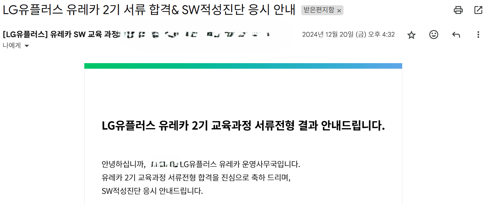
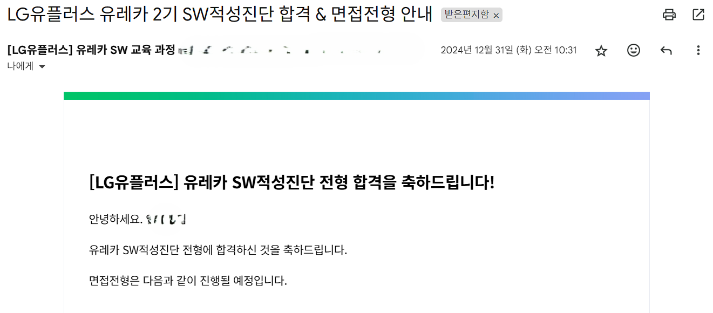
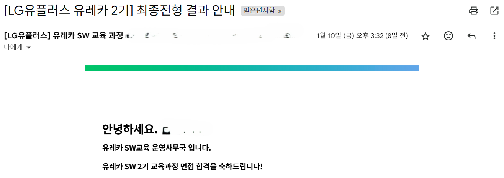

# 일정
+ 서류 접수 : 2024년 11월 11일 월요일 ~ 2024년 12월 16일 월요일
+ SW적성진단 (코딩테스트) : 2024년 12월 26일 목요일 ~ 2024년 12월 27일 금요일
+ 면접 : 2025년 1월 7일 화요일 ~ 2025년 1월 8일 수요일
+ 결과 : 2025년 1월 10일 금요일
+ OT : 2025년 1월 16일 목요일

&nbsp;

&nbsp;

## 서류 접수

1. LG 유플러스 유레카 SW교육에 지원하신 동기와 과정 수료 후, 이루고 싶은 취업 계획을 작성해 주십시오.
2. **[비전공생]** SW에 관심을 가지게 된 계기 혹은 취업 준비를 하며 겪었던 경험에 대해 작성하고, LG 유플러스 유레카 SW교육 과정을 통해 향후 어떤 개발자로 성장하고 싶은지 작성해 주십시오.
3. **[전공생]** SW 관련 경험 중 어려웠던 과제와 해결 방안에 대해 작성하고, LG 유플러스 유레카 SW교육 과정을 통해 향후 어떤 개발자로 성장하고 싶은지 작성해 주십시오. ※SW 관련 경험 : SW 개발, SW 프로젝트 및 경진대회 경험(참여, 수상 등), IT 관련 자격증 취득 등

&nbsp;

&nbsp;

먼저 1번은 내가 팀 프로젝트 활동에 재미를 느낀 이유와 백엔드 개발자로 성장하려고 정한 이유에 대해 사실적으로 작성하였다.

2번은 전공자이므로 패스.

3번은 현장실습형 인턴을 하면서 PHP와 Ptyhon으로 과제를 수행하며 유지보수의 중요성을 깨달은 내용에 대해 작성하였다.

서류 전형 발표는 **16시쯤** 왔다.

&nbsp;

&nbsp;

## SW적성진단 (코딩테스트)

전공자이므로 SW적성진단 (코딩테스트)를 봤다.

유레카는 특이하게 잡다에서 진행하였다.

[>>잡다 사이트 바로가기<<](https://www.jobda.im/)

어떤 형식으로 나오는지는 한번 날잡고 잡다에서 진행해보는 것이 최고다.

간략하게 설명한다면 크게 2문제와 각각 소문제 5개로 이루어진 총 10개의 문제를 풀어야한다.

1단계에서 5단계로 나아갈수록 요구하는 결과값이 조금씩 달라지기 때문에

이전 문제를 막무가내로 풀거나 노가다로 풀었으면 다음 코드에서 그만큼 시간이 잡아먹힌다.

난이도는 크게 어렵지 않았지만 1번 문제에서 시간초과 문제로 애를 먹었다.

결과 : 1번 3/5솔, 2번 5/5솔

코테 발표는 **10시쯤**에 왔다.

&nbsp;

&nbsp;

## 면접

간단한 1분 자기소개와 인턴 과정과 풀스택 프로젝트에서 팀장직을 맡았던 경험을 위주로 면접을 준비하였다. 특히 서류 전형에서 작성한 것처럼 팀프로젝트에 대해 재미를 느낀 부분과 백엔드 개발자가 되고 싶은 이유에 대해 준비하였다.

&nbsp;

&nbsp;

## 최종 발표

오전 10시부터 메일을 들여다보다가 지쳐서 꺼버릴때쯤 **15시**에 메일이 왔다.

&nbsp;

&nbsp;

## OT

LG 마곡 본사에서 진행한 OT에 참석했다.

~~사실 LG 본사에서 진행한다길래 대기업 본사 구경할겸 OT에 참석했다.~~

기존에 알고있던 내용과 더불어 강사님들의 이력과 필요한 준비과정에 대해 리마인드하였다.

가장 관심있게들은 내용은 아무래도 LG 유플러스 현업 개발자의 소개였다.

부트캠프 출신 개발자로 21년부터 본격적인 개발 공부를 시작해서 N년차 FE개발자로 일하고 있으며 가장 강조하신 부분은 **1년에 최소 1000커밋**은 할 정도의 노력과 기술블로그나 인프런 같은 다양한 매체를 활용해서 개발 지식을 지속적으로 학습하는 것을 추천하였다.

현업 개발자님의 조언덕분에 OT에 온 보람이 있었을 정도로 뜻깊이 들었다.

~~이후 MBTI I들을 죽이는 활동인 지옥의 레크리에이션이 시작되었다~~

&nbsp;

&nbsp;

## 앞으로
현업 개발자님의 조언에 따라 앞으로 배운 내용을 옮겨 적지않고 기존의 지식과 새롭게 알게된 지식을 비교해가며 기록할 것이다.

~~또한 기존에 github.io를 통해 작성하던 글도 velog로 이전할 계획이다.~~

이 블로그 또한 무시무시한 오류가 터지는거 아닌이상 이곳으로 정착할 계획이다.