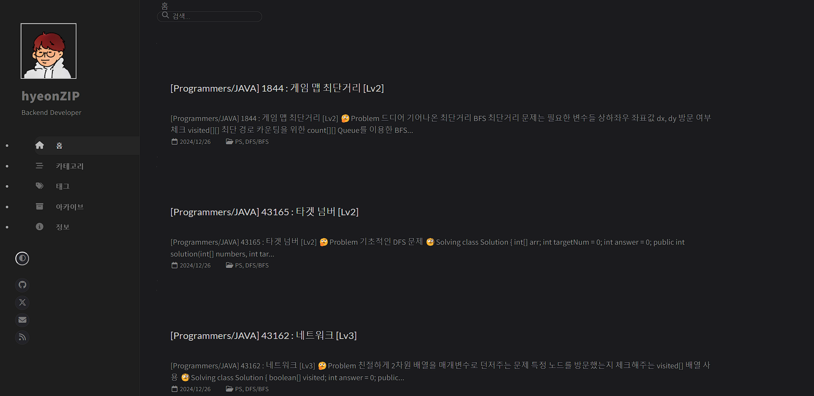

사실 처음부터 내 블로그를 만들자고 생각하지 않았다.

위의 이미지는 jekyll의 chripy테마로 만든 github.io 블로그이다.

똑같이 게시글을 올리다가 한번 깃허브 레포지토리를 보았더니

업데이트가 되고있지 않았다...

내가 직접 짠 코드가 아니다 보니 트러블 슈팅을 하는데 이틀이 지나도 해결될 기미가 보이지 않았다.

앞으로 버그가 생길 때마다 소요되는 시간을 생각해서 다른 방식을 이용하기로 결심하였다.

velog나 tistory도 있었지만 개인적인 욕심? 으로써 개인 사이트가 꼭 있었으면 하는 마음과

취준하면서 포트폴리오 제출용으로 블로그 주소를 넣고 싶었기에 Ruby를 사용하는 Jekyll 보다는

React를 사용하는 Gatsby를 사용하기로 했다.

그리고 눈여겨보던 블로그 중 [@hudi](https://hudi.blog/)님의 테마를 오마주 하기로 했다.

대략적인 구현할 기능 목록 10가지

+ 다크 모드
+ 태그
+ 시리즈
+ 포트폴리오 페이지
+ 댓글 달기
+ 방문자 수 확인
+ 바로가기 툴 바
+ 무한 스크롤
+ 게시글, 태그 검색

남는 짜투리 시간을 이용해서 사이드 프로젝트처럼 완성해 나갈 예정이다.